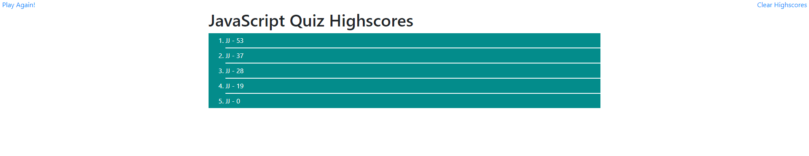

# JavaScript Quiz (Homework 04)

## Description

This is a quiz about JavaScript, written in JavaScript. The quiz is timed, and each wrong answer subtracts ten seconds from the remaining time. The score is the amount of time remaining when all of the questions are answered, or zero if the user runs out of time. The user then has the option to enter their initials to save their score locally, where it can be viewed on the highscores page. This project was an exercise in JavaScript DOM manipulation, JSON, and localStorage.

[Deployed here on Github Pages](https://johndjake.github.io/code-quiz/).

## Usage

Press start to begin the quiz. Click on the answer you believe is correct for each question. Enter your initials when prompted after the quiz is completed. Get to the highscores page anytime with the link in the top left corner of the page. Clear your highscores with the link in the top right corner of the highscores page.

## Credits

* Made with [Bootstrap](https://getbootstrap.com).

## License

MIT License

Copyright (c) 2020 John Jacobson

Permission is hereby granted, free of charge, to any person obtaining a copy
of this software and associated documentation files (the "Software"), to deal
in the Software without restriction, including without limitation the rights
to use, copy, modify, merge, publish, distribute, sublicense, and/or sell
copies of the Software, and to permit persons to whom the Software is
furnished to do so, subject to the following conditions:

The above copyright notice and this permission notice shall be included in all
copies or substantial portions of the Software.

THE SOFTWARE IS PROVIDED "AS IS", WITHOUT WARRANTY OF ANY KIND, EXPRESS OR
IMPLIED, INCLUDING BUT NOT LIMITED TO THE WARRANTIES OF MERCHANTABILITY,
FITNESS FOR A PARTICULAR PURPOSE AND NONINFRINGEMENT. IN NO EVENT SHALL THE
AUTHORS OR COPYRIGHT HOLDERS BE LIABLE FOR ANY CLAIM, DAMAGES OR OTHER
LIABILITY, WHETHER IN AN ACTION OF CONTRACT, TORT OR OTHERWISE, ARISING FROM,
OUT OF OR IN CONNECTION WITH THE SOFTWARE OR THE USE OR OTHER DEALINGS IN THE
SOFTWARE.